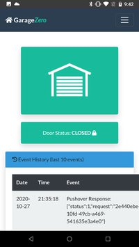
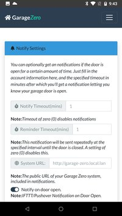
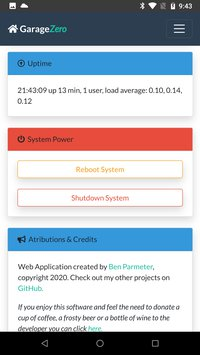
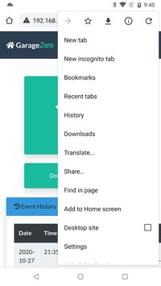

# Garage-Zero

## Raspberry Pi Zero based Garage Door Control / Status via Web Based Interface using Flask / Gunicorn / nginx
##### Also uses Bootstrap (http://getbootstrap.com/)

***Note:*** *This project is continuously evolving, and thus this readme will likely be improved over time, as I find the inspiration to make adjustments.  That being said, I'm sure there will be many errors that I have overlooked or sections that I haven't updated.*

This project was inspired by Chris Driscoll's "Idiot's Guide to a Raspberry Pi Garage Door Opener" (http://www.driscocity.com/idiots-guide-to-a-raspberry-pi-garage-door-opener/).  I've replicated Chris' hardware setup almost exactly, save for the Raspberry Pi Zero (instead of the Raspberry Pi Model B).  

Instead of using the WebIO libraries that Chris uses, I decided to implement things a bit differently, providing a dynamic webUI with bootstrap and Flask.  

Initially this project used Flask's native WSGI services without Gunicorn or nginx as a proxy.  However, I noticed that after some time, the app would become unresponsive.  After a little research, it appears that Flask's built in web server is for testing purposes only and shouldn't really be used in production.  With that said, I'm using Gunicorn and nginx to proxy web requests.  This is simple enough to configure and setup, however I had to redesign the application without the threading libraries, due to conflicts with Gunicorn.  Instead, I am using two processes running concurrently (control.py and app.py).  Control handles all of the RasPi GPIO interfaces, while App handles the web routes.  They communicate through a .json file that is human readable for simplicity.  

## Screenshots

The interface / webui is broken out into three main pages. The first is the dashboard view where you can check the current status of the garage door (whether it is open or closed), see the event history (button presses, opened/closed, notifications, reboots, etc.), and of course a large button to open/close the door (which also indicates green if closed, red if open).



Pressing the hamburger icon in the upper right of the interface, allows you to go to the history page, which gives you the detailed history of the last month of events.  


Pressing the hamburger icon in the upper right of the interface, allows you to also access to the administration screen. This interface allows you to configure the notification settings (i.e. e-mail and/or IFTTT notifications).



Scrolling down gives you more information about the system hardware, and the uptime.  


Scrolling down further gives you the option to reboot the system or shutdown the system.  



## Hardware Configuration

### The Parts List
The parts list and setup of this was heavily borrowed from the following guide here: [http://www.driscocity.com/idiots-guide-to-a-raspberry-pi-garage-door-opener/](http://www.driscocity.com/idiots-guide-to-a-raspberry-pi-garage-door-opener/)

* **Raspberry Pi Zero W** - Technically any Raspberry Pi with wireless capability will do fine, but for this application a Raspberry Pi Zero W works really well.  
* **Case for Raspberry Pi** *(optional)* - It's a good idea to have a case for the Pi and other electronics to shield it from environmental abuse.  I personally decided to develop a 3D printed case and have shared the STL files for you if you want to duplicate my setup. [Link to case files.](documents/case) For reference, I used an Creality Ender 3 to print the case, with 0.12 layer height.  I'm reasonably happy with the finished product, but your mileage may vary.  
* **2-Channel Relay** - I use both channels for one single door to prevent any spurious door open signals from being sent during reboot/shutdowns. [Amazon Link](https://www.amazon.com/dp/B0057OC6D8/ref=cm_sw_em_r_mt_dp_U_jtppCb3FQ787B)
* **Magnetic Switch** (This is only necessary if you want to be able to determine if the door is open or closed) [Amazon Link](https://www.amazon.com/dp/B0009SUF08/ref=cm_sw_em_r_mt_dp_U_htppCbJ7B52KG)
* **Wire** for the magnetic switch and connecting the Raspberry Pi to your garage door opener (I used extra CAT6 cable I had laying around, any 2-conductor cable ~20-24 gauge should be fine)
* **Micro SD Card** - Greater than 4GB is probably good.  
* **MicroUSB Power Adapter** - At least 1 amp current recommended.  Make sure you have a place to plug this in near your garage door opener
* **10k Ohm resistor** - Used for the resistor divider circuit on the magnetic switch. Prevents the switch input from floating and causing spurious inputs.
* **1k Ohm resistor** - Used for the resistor divider circuit on the magnetic switch. Prevents the switch input from floating and causing spurious inputs.

### The Schematic


#### GPIO Mapping
The following GPIOs are mapped for this project:
* **GPIO15** - Output Relay Control (Open / Close Garage Door)
* **GPIO14** - Output Relay Control Gate (Prevents spurious open/close events during power-on, shutdown and reboot cycles) **IMPORTANT:** This relay should have a wire connected to the Normally Closed (NC) side of the relay. Otherwise, it will not function properly, preventing all button presses.
* **GPIO18** - Input for Magnetic Switch (Current State of Garage Door)

**Note:**  *Optional design change.*  Per user [hmoffet](https://github.com/hmoffatt), there may not be a need for the 1k pull-down resistor.  It is probably OK to have the switch ground the input. Secondly there are fixed pull-up resistors of 1.8k on GPIOs 2 and 3 of the Raspberry PI. So you can just connect the switch directly to +3.3V and GPIO 2 or 3 without adding any extra resistors. If you make this design change, make sure you change the GPIO definition in the code from GPIO18 to GPIO2.  

**Note:** If you want to change which GPIOs you would like to use, please modify the control.py constants to what you want to use. Edit the following lines(*in control.py*):

```
    # GPIO Definitions
    relay_pin = 15			# GPIO 15, Pin 10 (RasPi Header)
    relay_gate_pin = 14		# GPIO 14, Pin 08 (RasPi Header)
    switch_pin = 18			# GPIO 18, Pin 12 (RasPi Header)
```

Truth Table for visualizing the output:

| IN1 | IN2 | Relay1 | Relay2 | Button Output |
|:---:|:---:|:------:|:------:|:-------------:|
|  0  |  0  |    C   |   O    | Not Pressed   |
|  0  |  1  |    C   |   C    | Pressed       |
|  1  |  0  |    O   |   O    | Not Pressed   |
|  1  |  1  |    O   |   C    | Not Pressed   |

*C=Closed/Connected*

*O=Open/Not Connected*

### Photos of the Hardware

A picture is worth a 1000 words.  With that, here is a bunch of pictures (with some words).  

Here is a picture of the Raspberry Pi Zero and the 2-channel relay module in the 3D-printed case.  Note that only the pins being used for GPIOs, GND, & Power on the header have been populated.  


I built this little daughter board to interface the Raspberry Pi with the 2-Channel relay board, as well as break-out wires for the magnetic switch/sensor.  The nice thing about this board is that it has headers that plug directly into the boards very easily (pictured here).


This is picture of the top of the daughter board (and the case/rpi/relay), which has the wire routing, and the two resistors (for the voltage divider).  


Picture of the daughter board actually plugged into the raspberry pi and relay inside the case.  This gives you a picture of the scale.  


This is an attempt at showing the daughter board installed in both the raspberry pi and the relay.   


The female pin connectors are hot-glued into the space in the corner of the case so that the magnetic sensor can be easily connected via male jumper pins.  Note that the rest of the boards have been hot-glued into place.  


The assembled kit all together in the case, with lid.  Note that the screws are still accessible from the top.  


Case mounted to the beam directly above the garage door opener using two screws on either side of the case.  


Another view of the installed case, with power cord. plugged in.


Another view of the installed case, with the garage door opener for scale.


Connections to the garage door opener terminals from the relay in the case.


View of the magnetic switch, mounted to the top of the garage door.  The wires connected via the CAT6 cable.  


## Software Installation:

### Walkthrough Installation Video

Added a walkthrough of the installation instructions on [youtube](https://youtu.be/OK_EWe1pKeE).  You'll probably still want to refer to the below instructions, but it's nice as a reference to see the install process in action.  

### Raspberry Pi Zero Setup Headless (*from raspberrypi.org*)
Once you've burned/etched the Raspbian Stretch Lite image onto the microSD card, connect the card to your working PC and you'll see the card being mounted as "boot". Inside this "boot" directory, you need to make 2 new files. You can create the files using Atom code editor.

+ Step 1: Create an empty file. You can use Notepad on Windows or TextEdit to do so by creating a new file. Just name the file **ssh**. Save that empty file and dump it into boot partition (microSD).

+ Step 2: Create another file name wpa_supplicant.conf . This time you need to write a few lines of text for this file. For this file, you need to use the FULL VERSION of wpa_supplicant.conf. Meaning you must have the 3 lines of data namely country, ctrl_interface and update_config

```
country=US
ctrl_interface=DIR=/var/run/wpa_supplicant GROUP=netdev
update_config=1

network={
    ssid="your_real_wifi_ssid"
    scan_ssid=1
    psk="your_real_password"
    key_mgmt=WPA-PSK
}
```

#### Run RasPi-Config
```
ssh pi@192.168.1.xxx

sudo raspi-config
```
+ Set locales
+ Set timezone
+ Replace Hostname with a unique hostname ('i.e. garage-zero')

### Automatic Software Installation (ALPHA)

I've created a script to install this automatically, but it is in ALPHA testing.  Your mileage may vary, and it's still recommended to try the below Manual Install.

After you've done the above steps to configure your raspberry pi, at the command line type the following:

```
curl https://raw.githubusercontent.com/nebhead/garage-zero/master/auto-install/install.sh | bash
```

Follow the onscreen prompts to complete the installation.  At the end of the script it will reboot, so just be aware of this.  

### Manual Software installation (Recommended)

#### Give pi user access to the GPIO pins
```
sudo adduser pi gpio
```

#### Install Git, Python PIP, Flask, Gunicorn, nginx, and supervisord
```
sudo apt update
sudo apt upgrade
sudo apt install python-pip nginx git gunicorn supervisor -y
sudo pip install flask
git clone https://github.com/nebhead/garage-zero
```

### Setup nginx to proxy to gunicorn

```
# Move into garage-zero install directory
cd ~/garage-zero

# Delete default configuration
sudo rm /etc/nginx/sites-enabled/default

# Copy configuration file to nginx
sudo cp garage-zero.nginx /etc/nginx/sites-available/garage-zero

# Create link in sites-enabled
sudo ln -s /etc/nginx/sites-available/garage-zero /etc/nginx/sites-enabled

# Restart nginx
sudo service nginx restart
```

### Setup Supervisor to Start GarageZero on Boot / Restart on Failures

```
# Move into garage-zero install directory
cd ~/garage-zero

# Copy configuration files (control.conf, webapp.conf) to supervisor config directory
# NOTE: If you used a different directory for garage-zero then make sure you edit the *.conf files appropriately
sudo cp *.conf /etc/supervisor/conf.d/

# If supervisor isn't already running, startup Supervisor
sudo service supervisor start

# If supervisor is running already, just reload the config files
sudo supervisorctl reread
sudo supervisorctl update

# Or just reboot and supervisord should kick everything off
sudo reboot
```
Optionally, you can use supervisor's built in HTTP server to monitor the scripts.

Inside of /etc/supervisor/supervisord.conf, add this:

```
[inet_http_server]
port = 9001
username = user
password = pass
```
If we access our server in a web browser at port 9001, we'll see the web interface that shows the status of the two scripts (WebApp and Control).  This gives you a quick and easy way to monitor whether any of the scripts has stopped functioning.  


### Configure Crontab for Log Backups

Configure crontab for the first time, to enable log backups on a monthly basis.

Edit crontab by starting crontab in edit mode.
```
sudo crontab -e
```

The first time this is run, it will ask you what editor you want to use.  I personally like to use nano, so I select this option.  

Add the following line to the end of the file:
```
0 0 1 * * cd /home/pi/garage-zero/logs && sh backup.sh
```
Then press CTRL-O to write out to the file the CTRL-X to exit the program.  

## Using GarageZero
If you've configured the supervisord correctly, GarageZero scripts should run upon a reboot.  Once the system is up and running, you should be able to access the WebUI via a browser on your smart phone, tablet or PC device.  

Simply navigate to the IP address of your device for example (you can usually find the IP address of your device from looking at your router's configuration/status pages). My router typically assigns IPs with prefixes of 192.168.1.XXX.  I'll use examples on my home network here, so you'll see URLs like: http://192.168.1.42  Yours may look different depending on your routers firmware/manufacturer (i.e. 10.10.0.XXX, etc.)

**Note:** It's highly recommended to set a static IP for your Pi in your router's configuration.  This will vary from manufacturer to manufacturer and is not covered in this guide.  A static IP ensures that you will be able to access your device reliably, without having to check your router for a new IP every so often.   

The interface / webui is broken out into three main pages. The first is the dashboard view where you can check the current status of the garage door (whether it is open or closed), see the event history (button presses, opened/closed, notifications, reboots, etc.), and of course a large button to open/close the door (which also indicates green if closed, red if open).


Pressing the hamburger icon in the upper right of the interface, allows you to go to the history page, which gives you the detailed history of the last month of events.  


Pressing the hamburger icon in the upper right of the interface, allows you to also access to the administration screen. This interface allows you to configure the notification settings (i.e. e-mail and/or IFTTT notifications).


Scrolling down gives you more information about the system hardware, and the uptime.  


Scrolling down further gives you the option to reboot the system or shutdown the system.  


### Adding GarageZero to your Homescreen using Chrome on your Android Phone

If you are an Android person, you are likely to be using Chrome on your phone and can not only setup a link to the web-app on your homescreen, but it also makes the interface look like a native application.  Pretty cool right?  Well here's how you set this up, it's very simple.  

First, navigate to the instance of GarageZero in your Chrome browser on your phone.  Remember, it's as easy as going to the IP address that was assigned to you device.  Then, from the Chrome drop-down menu in the upper right of the screen, select "Add to Home screen".  



Then, when the new dialog box pops up, you will have the opportunity to rename the application, or keep the default.


And there you have it, you've not only created a quick link to your garage door web-app, but you've also created a pseudo application at the same time.

### Set up e-mail notifications

Navigate to your administration and settings page in the web app.  From here, you can configure your notification settings.  Simply enter your e-mail credentials for the account you want to send FROM in the FROM E-mail box.  Then enter the e-mail address for the account you want to send e-mail notifications to in the TO E-mail box.  Then enter the SMTP server for the FROM E-mail account, the SMTP port and your password.  (UPDATE April 2019: It's now possible to enter multiple e-mails in the TO e-mail field, separated by commas)

Finally, set the time in minutes that the garage door is open before sending a notification and click on "Save"

That's it!  


### Set IFTTT notifications
If you are familiar with IFTTT then you can use this to setup an app notification on your smart phone.

Use the [Maker WebHooks applet](https://ifttt.com/maker_webhooks) to setup [notifications](https://ifttt.com/if_notifications).  

GarageZero uses the following event types:
* GarageEvent_Open_Alarm
	* 'value1': minutes
* GarageEvent_Closed
* GarageEvent_Notify_on_Open

For each of the event types above, simply create a WebHook applet that triggers on those events and sends a notification via the application.  

Example of WebHook for GarageEvent_Open_Alarm:


Example of WebHook for GarageEvent_Closed:


All that is needed to be configured on the web-app is to populate your IFTTT API Key in the administration/settings page under notification settings.  

Make sure you also configure the notify timeout (mins) or notifications will be disabled.  Once you've done this click save to apply the settings.

**Note:** You can also set IFTTT to notify you when the door is opened (no delay), by selecting the option to notify on open.  This currently only works for IFTTT notifications, not e-mail notifications.   


### Accessing GarageZero from outside your local network

Please take the utmost care in considering options for exposing GarageZero outside of your home network. Given that GarageZero has no real security built-in, anyone that is able to gain access to it directly or indirectly, may be able to control your garage door hardware which could result in damage to your property or even potentially physical harm to someone nearby.  

If you want to have access to GarageZero outside of your home network, and I haven't already convinced you not to do this, then I would recommend setting up a VPN for your local network.  This would allow you to tunnel to your home network and access all of your local equipment with some level of security.  A good, low cost, and dead simple VPN project I would recommend is [PiVPN](http://www.pivpn.io/).    
